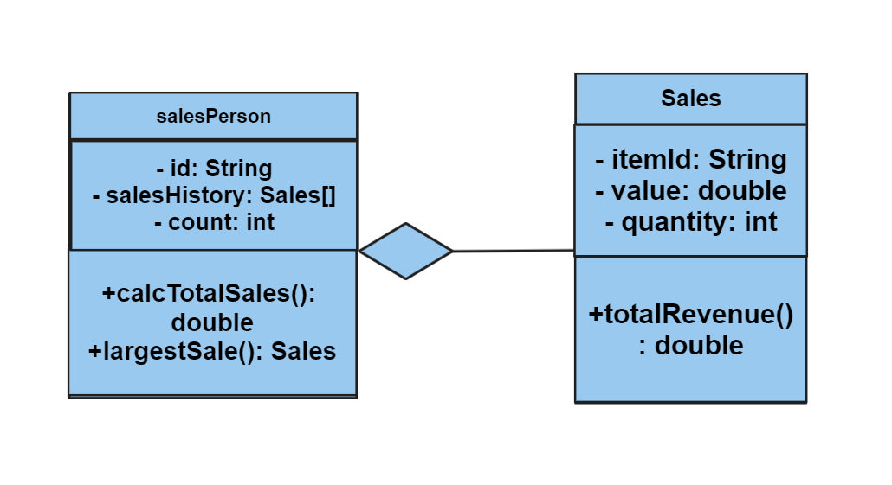

A large company with locations in different cities has taken an OOP approach in creating an administration program that manages all aspects of its business. These aspects include:
·the sale of all the different products that the company manages
·the salaries for managers, office staff and sales personnel.

1.(a) By making use of an example from the above scenario, distinguish between a class and an instantiation of a class. (3 points)
- Class is used for creating an object as a template which can provide initial value of variable in an object and also implement methods. When a specific class is available, we can initialize or instantiate the class in the main function. It also means that we are declaring the object in the main function. 
- An example can be taken from the above scenario is to manage the sale of all the different products. In here, we can create a class named `Sale` that can store the detail of the `price`, `name`, `sold`, and `quantity`. Other than that, we can also implement methods 'totalSale'. Let's say the formula for total sale is (sold * price) for now. In here, we can implement the formula in the totalSale methods, and return the value. After declaring the methods and the variable, we can instantiate the class in the main by declaring the object's variable such as `Sale sale = new Sale(1000, "Pencil", 
50, 100);`. After that, calling the methods inside a class is now possible by typing this code `sale.totalSale();`. We do not need to give parameters to the totalSale methods since it is already declared in the previous code.
- Another example can be taken from the above scenario is to define the salaries for managers, office staff and sales personnel. First of all, we need to create a class named `Employee` where it has variables of `names`, `jobPosition`, `id`. Let's say that manager earn 50k per month, office staff earn 35k and sales personnel earn 20k per month. We can create a method called `printSalary` which contains the if function which can define the salary by checking the employee position and return the correct salary value. After that, we can initialize the class in the main class by typing this code `Employee employee = new Employee('Budi', 'manager', '001');`. Lastly, we can call the method by `employee.printSalary();`.

The different modules in the program each open a graphical user interface (GUI). Each GUI has a similar design but contains differences specific to each module.

(b) By giving two examples, explain how the principles of inheritance can be incorporated into the design of this administration program. (4 points)

- Inheritance means that we are deriving a class from another class for a hierarchy of classes that share a set of attributes and methods and usually we use the `extends` to define the parent class. Thus, when a subclass need the details or methods from the parent class, we can use this 
```
public subClass extends parentClass{
...
}
```
- An example can be taken from second scenario from the above which include the employee positions. We can create the main class as the `Employee` and the other subclasses which are the employee positions such as `manager`, `staff` and `personnel`. Then we can inherit the subclass to the main class by doing these.
```Java
public class manager extends Employee{
    ...
} 
public class staff extends Employee{
    ...
}
public class personnel extends Employee{
    ...
}
```
- Another example that is related to the administration program where we need to create an GUI which needs to be inherited from a library called Java Swing such as `public class GUI extends JFrame{}`. 

(c) Describe how the use of libraries can facilitate the development of programs like this company’s administration program. (3 points)
- Libraries are really useful for company's administration program. This is because Libraries contain built in functions that would save time and mostly it is bug free and allow more option for the admin program. An example can be taken from the number 2 second example, where it used the library to create a GUI so the application will be user-friendly.

2. The company employs several sales personnel to sell its products to different retailers. Each branch of the company keeps track of its own sales with a suite of programs that include the two classes SalesPerson and Sales.
```Java
public class SalesPerson {

// each object contains details of one salesperson

private String id;

private Sales[] salesHistory; // details of the different sales

private int count = 0; // number of sales made


//constructor for a new salesperson

public SalesPerson(String id){

// code missing

}

 

// constructor for a salesperson transferred (together with their sales details) from another branch

public SalesPerson(String id, Sales[] s, int c){

// code missing

}

 

public int getCount(){return count;}

public String getId() {return id;}

public void setSalesHistory(Sales s){

salesHistory[count] = s;

count = count +1;

}

 

public double calcTotalSales(){

// calculates total sales for the salesperson

// code missing

}

 

public Sales largestSale(){

// calculates the sale with the largest value

// code missing

}

}
```
 

Each instance variable is initialized when a SalesPerson object is instantiated.

(a) Complete the constructor public SalesPerson(String id), from the SalesPerson class. (2 points) <br>
```java
public SalesPerson(String id){
this.salesHistory = new Sales[100];
this.id = id;
}
```

(b) Explain why accessor methods are necessary for the SalesPerson class. (3 points)

- Usually, classes variables are set to private due to security issues and we do not want other attributes have any access from it. Thus, we use the accessor methods to access the private attribute.

```Java
public class Sales {

// each object contains details of one sale

private String itemId;     // id of the item

private double value;      // the price of one item

private int quantity;      // the number of the items sold

// constructor missing

public double getValue() {return value;}

public int getQuantity() {return quantity;}

}
```


(c) (i) Construct unified modelling language (UML) diagrams to clearly show the relationship between the SalesPerson and Sales classes.

Note: There is no need to include mutator or accessor methods or a constructor. (4 points)


(c) (ii) Outline a negative effect that a future change in the design of the Sales object might have on this suite of programs. (2 points)

- If `SalesPerson` class changes, the `Sales` class also need to be changed so it will be compatible. This is because `SalesPerson` class has the `calcTotalSales` method that depends on the `Sales` class.
 

The company employs several sales personnel. The different salesPerson objects are held in the array salesPeople. The Driver class contains various methods that operate on the SalesPerson and Sales classes. The Driver class contains the following code:
```Java
public static void main(String[] args){

SalesPerson[] salesPeople = new SalesPerson[6];

salesPeople[0] = new SalesPerson("100");

salesPeople[1] = new SalesPerson("101");

salesPeople[2] = new SalesPerson("102");

salesPeople[0].setSalesHistory(new Sales("A100",300.00,10));

salesPeople[0].setSalesHistory(new Sales("A200",1000.00,2));

salesPeople[1].setSalesHistory(new Sales("A300",2550.40,10));

System.out.println(salesPeople[2].getId());

System.out.println(salesPeople[0].getCount());

System.out.println(salesPeople[1].getSalesHistory(0).getValue());

System.out.println(salesPeople[0].calcTotalSales());

 }
```
(d) State the output after running this code. (4 points)
```
102
2
2550.4
5000.0
```

(e) Construct the method calcTotalSales(), in the SalesPerson class that calculates the total value of the sales for a specific SalesPerson object. (5 points)
```Java
...
public double calcTotalSales(){
    // calculates total sales for the salesperson    
    // code missing
    double totalSales = 0;

    for(Sales sale : salesHistory){
        if(sale == null) break;            totalSales += sale.totalRevenue();
    }    
    return totalSales;
    }
...
```
 

The salesPeople array contains 100 instantiated objects. The company wishes to reward the salesperson whose sales have the largest total value.

(f) By making use of any previously written methods, construct the method highest(), that returns the ID of the salesperson whose sales have the largest total value. (5 points)
```Java
public String highest(SalesPerson[] salesPeople){
    double max = Double.MIN_VALUE;
    String id = null;

    for(SalesPerson s : salesPeople){
        if(s == null) break;
        if(s.calcTotalSales() > max){
            id = s.getId();
            max = s.calcTotalSales();
        }
    }

    return id;
}
```
(g) Construct the method addSales(Sales s, String id), in the Driver class, that will add a new Sales object s, to the salesperson with a specified ID.

```Java
public static void addSales(Sales s, String id){
    SalesPerson target = null;

    for(SalesPerson sp : salesPeople){
        if(sp.getId() == id){
            target = sp;
            break;
        }
    }

    if(target == null) return;

    target.setSalesHistory(s);
}
```

Note: You can assume that the ID is a valid one. (4 points)

 

A further class in this suite of programs is the Payroll class. This class is run at the end of each month to calculate each salesperson’s salary, which is based on the sales that have been made during that month.

(h) Suggest changes that must be made to the SalesPerson class and/or the Sales class to allow these calculations to be made. (3 points)

- In here, we can see that setter methods are not available in both classes. Thus, setter methods come in handy, they can rename or reassigned the integer where the value are false.

(i) Discuss the use of polymorphism that occurs in this suite of programs. (3 points)
- SalesPerson class uses the polymorphism. There are two seperate constructors inside the SalesPerson class and it means this is the implementation of polymorphism.
